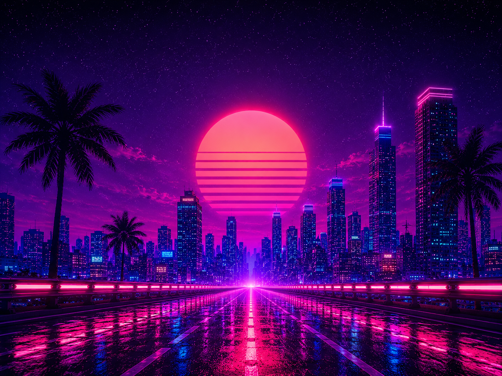
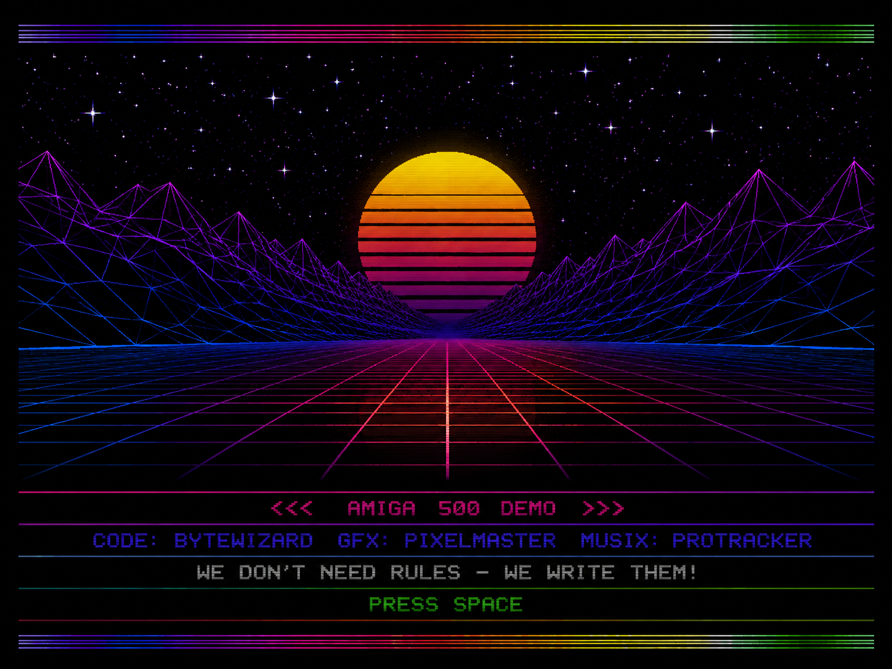

# omarchy-demo-scene-theme

Ein Omarchy-Theme im Stil der Demoscene- und Synthwave-Ära: tiefes Indigo-Schwarz als Hintergrund, weiches Lavendel als Vordergrund, dazu Neon-Akzente in Magenta, Cyan, Lime und Sonnen-Gelb.

## Screenshots

### Neon City



### Amiga 500 Demo



## Installation

```bash
omarchy theme install https://github.com/alexzeitler/omarchy-demo-scene-theme
```
